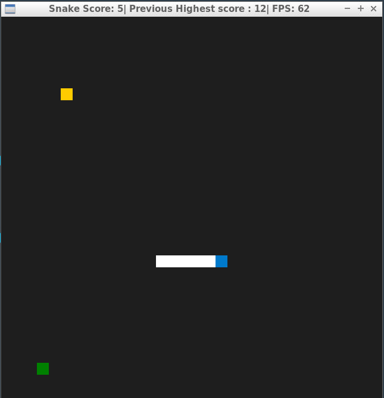
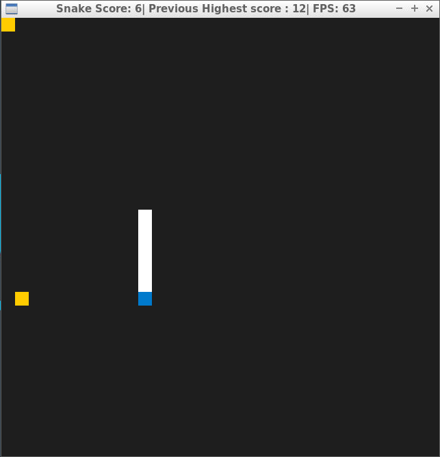
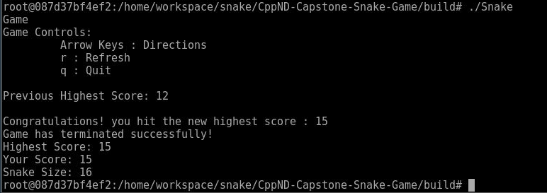

# CPPND: Capstone Snake Game Example

This is a starter repo for the Capstone project in the [Udacity C++ Nanodegree Program](https://www.udacity.com/course/c-plus-plus-nanodegree--nd213). 
The base code is taken from repo: https://github.com/udacity/CppND-Capstone-Snake-Game
The code for this repo was inspired by [this](https://codereview.stackexchange.com/questions/212296/snake-game-in-c-with-sdl) excellent StackOverflow post and set of responses.

In this project, I extend extend this Snake game to give bonus 15 second and keep track of highest score for multiple runs of the game. After user gets 5 food items, Special Food(green) item will apprear and user has 10 seconds to get this special food. 

If user is able to get the Special Food, the speed of snake will increase by 10% factor and there will be two foods appread on board for next 15 seconds as bonus time. 

Once 15 seconds passes game will go back to normal and if user get another 5 food iteam, another special food will appear.
If user make snake to bite itself, game will be over. User press "q" and stats will be shown on consol:

Note: src/highestscore file keeps the latest highes score. If you like to reset the stats, write 0 in the file.

## Dependencies for Running Locally
* cmake >= 3.7
  * All OSes: [click here for installation instructions](https://cmake.org/install/)
* make >= 4.1 (Linux, Mac), 3.81 (Windows)
  * Linux: make is installed by default on most Linux distros
  * Mac: [install Xcode command line tools to get make](https://developer.apple.com/xcode/features/)
  * Windows: [Click here for installation instructions](http://gnuwin32.sourceforge.net/packages/make.htm)
* SDL2 >= 2.0
  * All installation instructions can be found [here](https://wiki.libsdl.org/Installation)
  * Note that for Linux, an `apt` or `apt-get` installation is preferred to building from source.
* gcc/g++ >= 5.4
  * Linux: gcc / g++ is installed by default on most Linux distros
  * Mac: same deal as make - [install Xcode command line tools](https://developer.apple.com/xcode/features/)
  * Windows: recommend using [MinGW](http://www.mingw.org/)

## Basic Build Instructions

1. Clone this repo.
2. Make a build directory in the top level directory: `mkdir build && cd build`
3. Compile: `cmake .. && make`
4. Run it: `./SnakeGame`.

## Game Controls: 
Arrow Keys : Directions,    
           r : Refresh,     
           q : Quit,
        

## Known Bug: 
Known Bug: Sometimes new food is not apprearing on screen when snake get one food. 
Resolution: If this situation occus while playing, please hit "r" and it will refresh the game.

## Learning used from Udacity NanoDegree

1. Multithreading and handling data.
2. Multiple class and variables.
3. static variables handling
4. OOPS concepts.
5. How to use file operations in C++.
